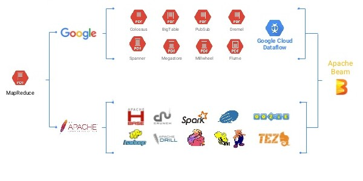

## Agenda
- global concept of our fround detection
- what is dataflow
- what is apache beam
- quickly describe project structure
- descibe the project code 

## Our fraud detector

Sample trade input file:

```
BS,Yotz,25c92654-aac9-4ef0-a532-d1df1612326f,Interactive Brokers LLC,Rabo Securities USA Inc.,57,PAB,Africa,54.98,37.34,3171.20,607.92,Active,41570605,248090018,1880621363,1604158196,2018-04-09,2018-04-10,7a2cc935-eb5c-4be4-b4c0-281d91efed21,2018-04-10T00:00
SS,Zoonder,41f01509-4e8c-448d-abe3-3f725a7634de,Mizuho Securities USA LLC,Cantor Fitzgerald & Co.,7,CDF,Africa,67.32,231.40,702.64,147.40,Correction,351217176,1717896528,794008364,603265844,2018-04-09,2018-04-10,a08e0c40-6fbe-457c-b363-715b514fdc2e,2018-04-10T00:01:26
SS,LiveZ,69cdc3d5-a4f4-4c06-82a3-dfdda3fafabf,Credit Suisse Securities (USA) LLC,Phillip Capital Inc.,6,JMD,Africa,99.97,186.77,786.59,367.04,Correction,56954968,179793288,458087528,2127570952,2018-04-09,2018-04-10,a5876150-a04e-496e-81b3-dfd81df0874f,2018-04-10T00:02:52
BS,Eayo,8732eee6-5714-4fa6-8f37-6b4693b64afb,Term Commodities Inc.,Dorman Trading L.L.C.,49,TZS,Africa,18.65,397.78,1311.63,354.96,Correction,1003755216,427232961,1412676551,713772300,2018-04-09,2018-04-10,c1ff8269-05a5-4c74-8cbd-17d3fb55f5e3,2018-04-10T00:04:19
SL,Skinte,415aa7cb-0948-4e08-af61-bb287f9e7971,Credit Suisse Securities (USA) LLC,BNP Paribas Securities Corp.,32,BGN,Asia,39.85,130.06,1405.26,508.88,Inactive,556105325,1096460217,437062855,136211935,2018-04-09,2018-04-10,0d1da855-87e8-4c3d-9bd3-da42a6f5b0d9,2018-04-10T00:05:45
BS,Yakijo,095cc2dd-629a-477a-b883-56f1e0d39f3d,HSBC Securities (USA) Inc.,Rand Financial Services Inc.,8,TND,America,48.79,123.87,514.19,160.58,Correction,1613434408,144675993,1712279215,803879096,2018-04-09,2018-04-10,48027d71-a7b8-45ca-ad67-3e8d8d29a02b,2018-04-10T00:07:12
SL,Centimia,23b44591-03e4-4b15-b70f-e7c0310b1d70,Wedbush Securities Inc.,EFL Futures Limited,88,MMK,Africa,84.96,2626.65,10103.13,2231.49,Inactive,163672733,752233789,1843180636,1249479966,2018-04-09,2018-04-10,30dc0091-edf1-4a3f-8317-e9ae171f43ab,2018-04-10T00:08:38
```

Sample rule: Yield fraud when Client has many small trades (less then amount 10) but the sum of them is very high (more than 100)

## History



## Dataflow

Cloud Dataflow is a fully-managed service for transforming and enriching data in stream (real time) and batch (historical) modes with equal reliability and expressiveness. 
And with its serverless approach to resource provisioning and management, you have access to virtually limitless capacity to solve your biggest data processing challenges, while paying only for what you use.

Features:
- **Automated Resource Management** - Cloud Dataflow automates provisioning and management of processing resources to minimize latency and maximize utilization; no more spinning up instances by hand or reserving them.
- **Dynamic Work Rebalancing** - Automated and optimized work partitioning dynamically rebalances lagging work. No need to chase down “hot keys” or pre-process your input data.
- **Reliable & Consistent Exactly-once Processing** - Provides built-in support for fault-tolerant execution that is consistent and correct regardless of data size, cluster size, processing pattern or pipeline complexity.
- **Horizontal Auto-scaling** - Horizontal auto-scaling of worker resources for optimum throughput results in better overall price-to-performance.
- **Unified Programming Model** - Apache Beam SDK offers equally rich MapReduce-like operations, powerful data windowing, and fine-grained correctness control for streaming and batch data alike.
- **Community-driven Innovation** - Developers wishing to extend the Cloud Dataflow programming model can fork and/or contribute to Apache Beam.

Transformation

- **PCollections** - the PCollection abstraction represents a potentially distributed, multi-element data set, that acts as the pipeline's data. Beam transforms use PCollection objects as inputs and outputs.
- **Transforms** - these are the operations in your pipeline. A transform takes a PCollection (or multiple PCollections) as input, performs an operation that you specify on each element in that collection, and produces a new output PCollection.
- **Pipeline I/O** - Beam provides read and write transforms for a number of common data storage types, as well as allows you to create your own.


## DataFlow - pipeline to find the frauds


**Code**
- Implementation: https://github.com/gft-academy-pl/gcp-anti-fraud-detector/blob/master/dataflow/detecting-frauds/src/main/java/com/gft/academy/FraudDetector.java
- Test: https://github.com/gft-academy-pl/gcp-anti-fraud-detector/blob/master/dataflow/detecting-frauds/src/test/java/com/gft/academy/FraudDetectorTest.java

```
cd ~/gcp-anti-fraud-detector/dataflow/detecting-frauds
```
 
**Run locally**

- Input: public dataset
- Output: local directory

```
mvn clean compile exec:java \
       -Dexec.mainClass=com.gft.academy.FraudDetector \
       -Dexec.args="--output=./target/frauds/ \
       --inputFile=gs://gft-academy-fraud-detector-public-data/trades-small.csv"
```
 
**Run on the DataFlow**

Enable API in order to be able to operate on DataFlow. Go to API&Services, search for Dataflow, and click Enable button, or use this link: https://console.cloud.google.com/apis/library/dataflow.googleapis.com

- Input: public dataset
- Output: output bucket

```
mvn clean compile exec:java \
      -Dexec.mainClass=com.gft.academy.FraudDetector \
      -Dexec.args="--project=${GOOGLE_CLOUD_PROJECT} \
      --inputFile=gs://${GCP_INPUT_BUCKET}/trades-small.csv \
      --output=gs://${GCP_OUTPUT_BUCKET}/frauds \
      --tempLocation=gs://${GCP_WORKSPACE_BUCKET}/frauds-tmp \
      --runner=DataflowRunner"
```

**Create job template**

```
mvn clean compile exec:java \
       -Dexec.mainClass=com.gft.academy.FraudDetector \
       -Dexec.args="--project=${GOOGLE_CLOUD_PROJECT} \
       --region=europe-west1 \
       --templateLocation=gs://${GCP_WORKSPACE_BUCKET}/templates/fraud-detector \
       --tempLocation=gs://${GCP_WORKSPACE_BUCKET}/frauds-tmp \
       --runner=DataflowRunner"
```

NPE issue: https://issues.apache.org/jira/browse/BEAM-2400 but the template is created.

## Documentation & Resources
- https://cloud.google.com/dataflow/docs
- https://cloud.google.com/dataflow/docs/quickstarts/quickstart-java-maven
- https://cloud.google.com/dataflow/docs/templates/overview
- https://cloud.google.com/dataflow/docs/templates/creating-templates
- https://cloud.google.com/dataflow/docs/templates/executing-templates

## Navigation

- [Previous Step](./01-storage.md)
- [Next Step](./03-cloud-functions.md)
